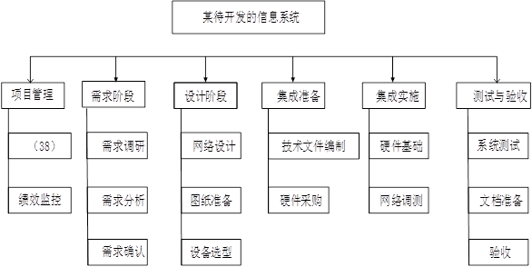

1.  系统实施阶段是将设计的系统付诸实施的阶段
2. 在架构评估过程中，评估人员所关注的是系统的质量属性
3. 表示集成是黑盒集成。控制集成是黑盒集成。数据集成是白盒集成
4. 黑盒测试也称为功能测试，主要用于集成测试、确认测试和系统测试中。黑盒测试将程序看作是一个不透明的黑盒，完全不考虑（或不了解）程序的内部结构和处理算法，而只检查程序功能是否按照SRS的要求正常使用，程序是否能适当地接收输入数据并产生正确的输出的信息，程序运行过程中能否保持外部信息（例如，文件和数据库等）的完整性等
5. 软件质量的六个特性：
    * 1.功能性：软件所实现的功能满足用户需求的程度．功能性反映了所开发的软件满足用户称述的或蕴涵的需求的程度，即用户要求的功能是否全部实现了。
    * 2.可靠性：在规定的时间和条件下，软件所能维持其性能水平的程度。可靠性对某些软件是重要的质量要求，它除了反映软件满足用户需求正常运行的程度，且反映了在故障发生时能继续运行的程度。
    * 3.易使用性：对于一个软件，用户学习、操作、准备输入和理解输出时，所做努力的程度。易使用性反映了与用户的友善性，即用户在使用本软件时是否方便。
    * 4.效率：在指定的条件下，用软件实现某种功能所需的计算机资源（包括时间）的有效程度。效率反映了在完成功能要求时，有没有浪费资源，此外"资源";这个术语有比较广泛的含义，它包括了内存、外存的使用，通道能力及处理时间。
    * 5.可维修性：在一个可运行软件中，为了满足用户需求、环境改变或软件错误发生时，进行相应修改所做的努力程度。可维修性反映了在用户需求改变或软件环境发生变更时，对软件系统进行相应修改的容易程度。一个易于维护的软件系统也是一个易理解、易测试和易修改的软件，以便纠正或增加新的功能，或允许在不同软件环境上进行操作。
    * 6.可移植性：从一个计算机系统或环境转移到另一个计算机系统或环境的容易程度
6. *GB/T 8566-2007*《信息技术 软件生存周期过程》把软件生存周期中可能执行的活动氛围5个基本过程、9个支持过程和7个组织过程。不包括工程过程
7.
    * 类图（class diagram）：展现了一组类、接口、协作和它们之间的关系。在面向对象系统的建模中所建立的最常见的图就是类图。类图给出了系统的静态设计视图。包含主动类的类图给出了系统的静态进程视图。
    * 定时图（timing diagram）：也是一种交互图，它展现了消息跨越不同对象或角色的实际时间，而不仅仅只是关心消息的相对顺序。
    * 状态图（state diagram）：展现一个状态机，它由状态、转移、事件和活动组成。状态图展现了对象的动态视图。它对于接口、类或协作的行为建模尤为重要，而且它强调事件导致的对象行为，这非常有助于对反应式系统建模。
    * 对象图（object diagram）：展现了一组对象及它们之间的关系。对象图描述了在类图中所建立的事物实例的静态快照。和类图一样，这些图给出系统的静态设计视图或静态进程视图，但它们是从真实案例或原型案例的角度建立的。
    * 用例图（use case diagram）：展现一组用例、参与者（一种特殊的类）及它们之间的关系，它描述了系统与外部系统及用户之间的交互。用例图给出系统的静态用例视图。这些图在对系统的行为进行组织和建模时是非常重要的。主要的作用有三个：（1）获取需求；（2）指导测试；（3）还可在整个过程中的其它工作流起到指导作用。
    * 部署图（deployment diagram）：展现了对运行时的处理结点及在其中生存的构件的配置。部署图给出了架构的静态部署视图，通常一个结点包含一个或多个部署图。
    * 顺序图（sequence diagram）：又称序列图。是一种交互图（interaction diagram），交互图展现了一种交互，它由一组对象或角色以及它们之间可能发送的消息构成。交互图专注于系统的动态视图。顺序图是强调消息的时间次序的交互图。
8.
    * 逻辑视图也称为设计视图，它表示了设计模型中在架构方面具有重要意义的部分，即类、子系统、包和用例实现的子集。
    * 进程视图是可执行线程和进程作为活动类的建模，它是逻辑视图的一次执行实例，描述了并发与同步结构。
    * 实现视图对组成基于系统的物理代码的文件和构件进行建模。
    * 用例视图是最基本的需求分析模型。
9. 立项阶段结束的里程碑应该是可行性研究报告、项目评估报告、系统设计任务书
10. 软件需求是针对待解决问题的特性的描述。所定义的需求必须可以被验证。在资源有限时，可以通过优先级对需求进行权衡。
    通过需求分析，可以检测和解决需求之间的冲突；发现系统的边界；并详细描述出系统需求。
    * 需求的分析过程包括: 收集与获取需求，进行需求分析，定义需求（编写需求说明书），以及需求验证四个阶段。
11. 取需求的办法包括问卷调查，会议讨论，获取原型；决策分析通常是用在规划风险应对的时候，或者做项目可行性研究的时候
12. 软件设计过程定义了一个开放的接口；软件开发流程即软件设计思路和方法的一般过程，包括设计软件的功能和实现的算法和方法、软件的总体结构设计和模块设计、编程和调试、程序联调和测试以及编写、提交程序等一系列操作。其中软件设计又分为概要设计与详细设计两个阶段。
     * 概要设计
       首先，开发者需要对软件系统进行概要设计，即系统设计。概要设计需要对软件系统的设计进行考虑，包括系统的基本处理流程、系统的组织结构、模块划分、功能分配、接口设计、运行设计、数据结构设计和出错处理设计等，为软件的详细设计提供基础
     * 详细设计
       在概要设计的基础上，开发者需要进行软件系统的详细设计。在详细设计中，描述实现具体模块所涉及到的主要算法、数据结构、类的层次结构及调用关系，需要说明软件系统各个层次中的每一个程序(每个模块或子程序)的设计考虑，以便进行编码和测试。应当保证软件的需求完全分配给整个软件。详细设计应当足够详细，能够根据详细设计报告进行编码
13.
     * 评审与审计：包括管理评审、技术评审、检查、走查、审计等。
     * 管理评审的目的是监控进展，决定计划和进度的状态，或评价用于达到目标所用管理方法的有效性。
     * 技术评审的目的是评价软件产品，以确定其对使用意图的适合性，目标是识别规范说明和标准的差异，并向管理提供证据，以表明产品是否满足规范说明并遵从标准，而且可以控制变更
     * 审计：审计是正式组织的活动，识别违例情况，并产生一个报告，采取更正性行动。
     * 质量保证：通过制订计划、实施和完成等活动保证项目生命周期中的软件产品和过程符合其规定的要求
     * 软件开发的技术评审是一种由软件工程师和其他人进行的软件质量保障活动。
       其目标包括：
       1) 发现功能、逻辑或实现的错误；
       2) 证实经过评审的软件的确满足需求；
       3) 保证软件的表示符合预定义的标准；
       4) 得到一种一致的方式开发的软件；
       5) 使项目更易管理。
14. 软件审计是对过程的遵从性评价；
     * 软件审计的目的是提供软件产品和过程对于可应用的规则、标准、指南、计划和流程的遵从性的独立评价。审计是正式组织的活动，识别违例情况，并产生一个报告，采取更正性行动。
     * 软件质量保证：通过制订计划、实施和完成等活动保证项目生命周期中的软件产品和过程符合其规定的要求
     * 软件过程管理：软件过程为一个为建造高质量软件所需完成的任务的框架，即形成软件产品的一系列步骤，包括中间产品、资源、角色及过程中采取的方法、工具等范畴。不同的体系会有不同的划分，美国PMI将其划分为启动、规划、执行、监控、收尾五大过程组。软件过程管理即将软件的各过程组过程使用系统的方法管理起来。
     * 软件走查的目的是评价软件产品，走查也可以用于培训软件产品的听众，主要目标是：发现异常、改进软件产品、考虑其他实现、评价是否遵从标准和规范说明。走查类似于检查，但通常不那么正式。走查通常主要由同事评审其工作，以作为一种保障技术。
15. 软件测试工作在需求阶段就应该开始
16. 使用质量的定义：软件产品使指定用户在特定的使用环境下达到满足有效性、生产率、安全性及满意度要求的特定目标的能力
17. GB/T 16680-2015《系统与软件工程用户文档的管理者需求》，管理者应制定和维护用户文档编制计划,用户文档编制计划内容如下:
     1) 文档开发过程中实施的质量控制
     2) 用户文档的可用性要求
     3) 确定用户文档需要覆盖的软件产品
18. 信息系统安全包含人为，管理和技术层面的威胁，不包含功能与效率风险不属于信息系统的安全威胁。
19. 面向对象设计的基本任务:
     1) 设计用例实现方案
     2) 设计技术支撑设施
     3) 设计用户界面
     4) 精化设计模型
20. UML是一个通用的可视化建模语言，它是面向对象分析和设计的一种标准化表示，UML适用于各种软件开发方法、软件生命周期的各个阶段、各种应用领域以及各种开发工具，UML并没有定义一种标准的开发过程，但它比较适用于迭代式的开发过程。UML不是一种可视化的程序设计语言，而是一种可视化的建模语言。UML不是过程也不是方法，但允许每一种过程和方法使用它。UML描述了系统的静态结构和动态行为，它将系统描述为一些独立的相互作用的对象，构成为外界提供一定功能的模型结构，静态结构定义了系统中重要对象的属性和服务，以及这些对象之间的相互关系，动态行为定义了对象的时间特性和对象为完成目标而相互进行通信的机制
21.
    * 运维工作中是包含软件工程一大类的
    * 运行维护的目的就是保证系统正常运用，所以保证系统的可用性和稳定性是运维工作的重要目的之一
    * 运维工程师要进行运维工作，当然需要定期进行巡检
    * **运维工作量的结算不应以运维工程师的统计为依据 ，应该是实际系统本身或是系统变更为一定的依据**
22. 变更管理的基本原则是首先建立项目基准、变更流程和变更控制委员会。
    1) 基准管理\
    基准是变更的依据。在项目实施过程中，制定基准计划并经过评审后即建立初始基准，此后应针对每次批准的变更重新确定基准。A正确
    2) 建立变更控制流程\
    建立或选用符合项目需要的变更管理流程后，所有变更都必须遵循这个流程进行控制。流程的作用在于将变更的原因、专业能力、资源运用方案、决策权、干系人的共识和信息流转等元素有效地综合起来，按科学的顺序进行变更。C正确
    3) 建立变更控制委员会
    4) 完整体现变更的影响
    5) 变更产生的相关文档应纳入配置管理中
    可以使用手工或自动化工具进行配置管理，目前常用的配置管理工具有Rational ClearCase、Perforce、CA CCC/Havest、Merant PVCS、Microsoft VSS、CVS等，常用的开源免费的配置管理工具有SVN、GIT、CVS等
23.
    * 软件设计:\
    根据软件需求，产生一个软件内部结构的描述，并将其作为软件构造的基础。通过软件设计，**描述出软件架构及相关组件之间的接口**；然后，进一步详细地描述组件，以便能构造这些组件。
       通过软件设计得到要实现的各种不同模型，并确定最终方案。其可以划分为软件架构设计（也叫做高层设计）和软件详细设计两个阶段。
    * 软件需求:\
     是针对待解决问题的特性的描述。所定义的需求必须可以被验证。在资源有限时，可以通过优先级对需求进行权衡。通过需求分析，可以检测和解决需求之间的冲突；发现系统的边界；并详细描述出系统需求。
24. 软件维护有如下类型：
    * (1)更正性维护：更正交付后发现的错误；
    * (2)适应性维护：使软件产品能够在变化后或变化中的环境中继续使用；
    * (3)完善性维护：改进交付后产品的性能和可维护性；
    * (4)预防性维护：在软件产品中的潜在错误成为实际错误前，检测并更正它们
25. 需求状态如下：
    * （1）已建议：该需求已被有权提出需求的人建议；
    * （2）已批准：该需求已被分析，估计了其对项目余下部分的影响（包括成本和对项目其余部分的干扰），已用一个确定的产品版本号或创建编号分配到相关的基线中，软件开发团队已同意实现该项需求；
    * （3）已实现：已实现需求代码的设计、编写和单元测试；
    * （4）已验证：使用所选择的方法已验证了实现的需求，例如测试和检测，审查该需求跟踪与测试用例相符。该需求现在被认为完成；
    * （5）已删除: 计划的需求已从基线中删除，但包括一个原因说明和做出删除决定的人员
26. 典型的信息系统项目开发的过程中，需求分析阶段拟定了系统的目标、范围和要求，而系统各模块的算法一般在详细设计阶段确定。
     * 在软件需求分析阶段，已经搞清楚了软件“做什么”的问题，并把这些需求通过规格说明书描述出来，这也是目标系统的逻辑模型。
     * 进入了设计阶段，要把软件“做什么”的逻辑模型变换为“怎么做”的物理模型，即着手实现软件的需求，并将设计的结果反映在“设计规格说明书”文档中，所以软件设计是一个把软件需求转换为软件表示的过程，最初这种表示只是描述了软件的总的体系结构，称为“软件概要设计”或“结构设计”；然后对结构进一步细化，称为“详细设计”或“过程设计”。
27. 测试时为了评价和改进产品质量、识别产品的缺陷和问题而进行的活动。
     * 软件测试时针对一个程序的行为，在有限测试用例集合上，动态验证是否达到预期的行为。
     * 测试不再只是一种仅在编码阶段完成后才开始的活动。
     * 现在的软件测试被认为是一种应该包括在整个开发和维护过程中的活动，它本身是实际产品构造的一个重要部分。软件测试伴随开发和维护过程，通常可以在概念上划分为单元测试、集成测试和系统测试三个阶段。
       项目投入测试的时间应该是占用一定的比例，达到测试的目的和效果。不可以随意多一点少一点。
28. 数据流图（Data Flow Diagram）：简称DFD，它从数据传递和加工角度，以图形方式来表达系统的逻辑功能、数据在系统内部的逻辑流向和逻辑变换过程，是结构化系统分析方法的主要表达工具及用于表示软件模型的一种图示方法。
     数据流程图中有以下几种主要元素：
     1. 数据流。数据流是数据在系统内传播的路径，因此由一组成分固定的数据组成。如订票单由旅客姓名、年龄、单位、身份证号、日期、目的地等数据项组成。由于数据流是流动中的数据，所以必须有流向，除了与数据存储之间的数据流不用命名外，数据流应该用名词或名词短语命名。
     2. 源点和终点(又称端点)是系统外的实体，称作外部项。它们存在于环境之中，与系统有信息交流，从源点到系统的信息叫系统的输入；从系统到终点的信息称系统的输出。同—个端点可以是人或其它系统。在DFD中引入源点和终点是为了便于理解系统，所以不需要详细描述它们。它们可有编号，以“S”开头。
     3. 对数据的加工（处理）。加工是对数据进行处理的单元，它接收一定的数据输入，对其进行处理，并产生输出。
     4. 数据存储。表示信息的静态存储，可以代表文件、文件的一部分、数据库的元素等。
            数据流图有四种基本图形符号：“→”箭头，表示数据流； 〇：圆或椭圆，表示加工； =：双杠(带一边开口,一边闭合)，表示数据存储； □：方框，表示数据的源点或终点。
29. 面向对象建模方法有很多种，也都在进一步的发展和完善中。OMT法是目前最为成熟和实用的方法之一。它从三个方面对系统进行建模，每个模型从一个侧面反映系统的特性，
    * 三个模型分别是：对象模型、动态模型和功能模型。
    * 形象地说，功能模型定义“系统应该做什么”，状态模型定义“系统应该何时做”，对象模型定义“系统应该对谁做”。
30. 本考题考查的知识点为UML（统一建模语言）基本概念。
    * 依赖关系：描述了一个类的变化对依赖于它的类产生影响的情况
    * 关联关系：描述了类的结构之间的关系
    * 聚合关系：特殊关联关系，指明一个聚集（整体）和组成部分之间的关系
    * 组合关系：语义更强的聚合，部分和整体具有相同的生命周期
    * 包含：箭头指向的用例为被包含的用例，称为包含用例；箭头出发的用例为基用例。包含用例是必选的，如果缺少包含用例，基用例就不完整；
    * 扩展：箭头指向的用例为被扩展的用例，称为扩展用例；箭头出发的用例为基用例。
    * 泛化：泛化关系是一般和特殊关系，发出箭头的一方代表特殊的一方，箭头指向的一方代表一般一方。常存在于父类与子类、父接口与子接口之间。
31. 需求分析可分为需求提出、需求描述及需求评审三个阶段。
    * 需求提出: 主要集中于描述系统目的。需求提出和分析仅仅集中在使用者对系统的观点上。开发人员和用户确定一个问题领域，并定义一个描述该问题的系统。这样的定义称作系统规格说明，并且它在用户和开发人员之间充当合同。
    * 需求描述: 在问题分析阶段分析人员的主要任务是：对用户的需求进行鉴别、综合和建模，清除用户需求的模糊性、歧义性和不一致性，分析系统的数据要求，为原始问题及目标软件建立逻辑模型。分析人员要将对原始问题的理解与软件开发经验结合起来，以便发现哪些要求是由于用户的片面性或短期行为所导致的不合理要求，哪些是用户尚未提出但具有真正价值的潜在需求。
    * 需求评审: 在需求评审阶段，分析人员要在用户和软件设计人员的配合下对自己生成的需求规格说明和初步的用户手册进行复核，以确保软件需求的完整、准确、清晰、具体，并使用户和软件设计人员对需求规格说明和初步的用户手册的理解达成一致。一旦发现遗漏或模糊点，必须尽快更正，再行检查。
32.
    * 从是否关心软件内部结构和具体实现的角度划分白盒测试、黑盒测试、灰盒测试。 白盒测试称结构测试、透明盒测试、逻辑驱动测试或基于代码的测试。关于白盒测试和黑盒测试，其分类方法就是测试人员是否需要知道代码实现，是否需要对实现的代码和逻辑结构进行测试。
    * 从是否执行程序的角度划分静态测试和动态测试。
    * 从软件开发的过程按阶段划分有单元测试、集成测试、确认测试、系统测试、验收测试
33.
    * 软件项目中的测试管理过程包括制定测试计划及用例、执行测试、发现并报告缺陷、修正缺陷、重新测试
    * 根据近阶段测试情况，现把测试分为三个阶段：测试准备阶段，测试实现阶段、测试总结阶段。
      1. 测试准备阶段：即完成测试计划、测试用例、测试数据准备、测试环境准备及部署测试。
      2. 测试实现阶段：实际的测试过程，在此阶段中经历功能测试、集成测试、系统测试、 回归测试。但功能测试、集成测试、系统测试根据测试时间及人力可能是并行进行也可能是迭代进行。
      3. 测试总结阶段：对整个测试过程及测试问题进行总结提出改进建议。
     * 在我们现阶段测试中测试的分类为：功能测试、集成测试、系统测试、回归测试。 功能测试主要以功能实现为基础。集成测试以业务数据流为基础进行测试。系统测试主要在不同平台或操作系统下进行的测试。回归测试主要针对以上问题进行测试。
34. 回归测试：回归测试是指修改了旧代码后，重新进行测试以确认修改没有引入新的错误或导致其他代码产生错误。自动回归测试将大幅降低系统测试、维护升级等阶段的成本
35. 软件架构主要职责
     * （1）、确认需求 在项目开发过程中，架构师是在需求规格说明书完成后介入的，需求规格说明书必须得到架构师的 认可。架构师需要和分析人员反复交流，以保证自己完整并准确地理解用户需求。
     * （2）、系统分解 依据用户需求，架构师将系统整体分解为更小的子系统和组件，从而形成不同的逻辑层或服务。随 后，架构师会确定各层的接口，层与层相互之间的关系。架构师不仅要对整个系统分层，进行“纵向 ”分解，还要对同一逻辑层分块，进行“横向”分解。这体现了软件架构师的功力。
     * （3）、技术选型 架构师通过对系统的一系列的分解，最终形成了软件的整体架构。技术选择主要取决于软件架构。 例如：Web Server运行在Windows上还是Linux上？数据库采用MSSql、Oracle还是Mysql？是否需要采 用MVC或者Spring等轻量级的框架？前端采用富客户端还是瘦客户端方式？架构师对产品和技术的选 型只限于评估，没有决定权，最终的决定权归项目经理。架构师提出的技术方案为项目经理提供了重 要的参考信息，项目经理会从项目预算、人力资源、时间进度等实际情况进行权衡，最终进行确认。
     * （4）、制定技术规格说明 架构师在项目开发过程中，是技术权威。他需要协调所有的开发人员，与开发人员一直保持沟通， 始终保证开发者依照它的架构意图去实现各项功能。架构师通过它制定的技术规格说明书（UML视图 、Word文档，Visio文件）与开发者沟通，保证开发者可以从不同角度去观察、理解各自承担的子系 统或者模块。架构师还需要与项目经理、需求分析员，甚至与最终用户保持沟通。
36. 对象是对客观事物的抽象，类是对对象的抽象。它们的关系是，对象是类的实例，类是对象的模板。雷和对象，可以先声明类类型，然后再定义对象，也可以在声明类类型的同时定义对象
37. 面向服务的企业架构为了更能适应多变的业务需求，第一次把开发和运维也纳入到企业架构中，和运行架构一同组成了企业架构，这样就消除了企业中应用的烟囱式结构，取而代之的是服务共享的一体化信息系统体系。这样保证了面向服务的企业架构能发挥出最大的价值，更能IT需求到上线、维护一体化地实现IT战略的价值。
38. 软件度量包括3个维度，即项目度量、产品度量和过程度量。
     * 项目度量是针对软件开发项目的特定度量，目的在于度量项目规模、项目成本、项目进度、顾客满意度等，辅助项目管理进行项目控制。
     * 软件产品度量用于对软件产品进行评价，并在此基础之上推进产品设计、产品制造和产品服务优化。软件产品的度量实质上是软件质量的度量，而软件的质量度量与其质量的周期密切相关。
     * 软件过程性能 过程度量是对软件开发过程的各个方面进行度量，目的在于预测过程的未来性能，减少过程结果的偏差，对软件过程的行为进行目标管理，为过程控制、过程评价持续改善提供定量性基础。
39. 软件测试时一个系列过程活动，软件测试是针对一个程序的行为，在<strong>有限</strong>测试用例集合上，动态验证是否达到预期的行为，需要选取适当的测试用例。测试不仅是检错预防措施是否有效的主要手段，而且是识别由于某种原因预防措施无效而产生的错误的主要手段
40. 黑盒测试又叫功能测试,它不涉及程序的内部逻辑。除了测试程序外，它还适用于对需求分析阶段的软件文档进行测试。
     黑盒测试、白盒测试、α测试和β测试。
41.
    * 各模块间联系的紧密度是指耦合性。
      耦合性也叫块间联系。指软件系统结构中各模块间相互联系紧密程度的一种度量。模块之间联系越紧密，其耦合性就越强，模块之间越独立则越差，模块间耦合的高低取决于模块间接口的复杂性，调用的方式以及传递的信息。
    * 内聚性，又称块内联系，指模块的功能强度的度量，即一个模块内部各个元素彼此结合的紧密程度的度量。
      内聚性是对一个模块内部各个组成元素之间相互结合的紧密程度的度量指标。模块中组成元素结合的越紧密，模块的内聚性就越高，模块的独立性也就越高。理想的内聚性要求模块的功能应明确、单一，即一个模块只做一件事情。模块的内聚性和耦合性是两个相互对立且又密切相关的概念
42. 运维管理平台使运维自动化、操作化，但是并没有降低对运维人员的技术要求
43.
    * 对象：由数据及操作所构成的封装体，是系统中用来描述客观事物的一个封装是构成系统的一个基本单位。对象三要素：对象标识、对象状态、对象行为。
    * 类：是现实世界实体化的描述。类将实体的数据和函数封装在一起。类的数据也叫状态、属性或特征。它表示静态的一面；类的函数也叫功能、操作或服务，表现类的动态一面。
      类和对象的关系：对象是类的实例。一个类可以有多个对象，一个对象只能是一个类的实例。
44. 组件是软件系统可替换的、物理的组成部分，它封装了实现体（实现某个职能）．并提供了一组接口的实现方法。可以认为组件是一个封装的代码模块或大粒度的运行对的模块，也可将组件理解为具有一定功能、能够独立工作或同其他组件组合起来协词工作的对象
45. 项目计划制定(38)是项目管理过程中的重要活动\
     
46.
    * 实时信息系统是系统需要及时响应外界事件的请求在规定的严格时间内完成事件的处理，要求的是实时。
    * 批处理信息系统是作业成批处理和多道程序运行，即在系统内同时存放并运行几道项目独立的程序，有系统成批处理的重点是多任务批处理。
    * 管理信息系统是人利用计算机软硬件等办公设备进行信息的收集、整理、传输、存储等。
    * 联网信息系统关注的重点是通过互联网，可以做到信息的传输与同步。联网信息系统是基于计算机网络，在各种操作系统上按照网络体系结构协议、标准开发的软件，包括网络管理、通信、安全、资源共享和各种网络应用。在网联信息系统下，网络中的多台计算机能相互连通和进行资源共享。
47. 项目实施阶段，是将设计阶段的成果在计算机或网络上具体实现，即将设计文本变成真实的可交付成果
48. 软件工程管理继承了过程管理和项目管理的内容，分别是
     1. 启动
     2. 范围定义
     3. 软件项目计划
     4. 软件项目实施
     5. 评审和评价
     6. 关闭软件工程度量等六个方面
49. 结构设计基础知识
     * 结构设计主要是定义系统各主要部件的关系。
     * 数据设计时根据分析模型转化数据结构，
     * 接口设计时描述如何通信，
     * 过程设计时把系统结构部件转化为软件的过程性描述。
50. bug处理流程：先发现bug，确认bug所属模块，填写测试报告；然后PM将bug分配给开发人员；开发人员判断，如果是自己负责的，就对问题进行处理，如果不是就让PM重新分配；测试人员再对已经修改的bug做回归测试
51. 《软件工程术语》中对接口的定义：它是一个共享的边界，信息跨边界传送。链接两个或多个其他部件，为了相互间传送信息的硬件或软件部件
52. 对象的多态性是指两个或多个属于不同类的对象，对于同一个消息（方法调用）作出不同响应的方式
53. 信息系统生命周期由系统分析、系统设计、系统实施以及系统管理和维护四个时期组成，每一个时期又进一步划分成若干个阶段。
    1. 系统分析
    系统的分析，也叫系统的调查与分析，是信息系统生命周期的第一个阶段，也是最重要的一个环节。系统分析时期的任务包括确定信息系统必须完成的**总目标**，确定工程的**可行性**，导出实现工程目标应该采取的**策略及系统必须完成的功能**，估计完成该项工程需要的资源和成本，并且制定工程进度表。系统分析时期通常进一步划分成三个阶段，即问题的定义、可行性研究和需求分析。
        1. **问题定义阶段**的主要任务是确定所开发的信息系统要完成的目标是什么，如果不知道信息系统的目标就试图开发信息系统，显然是盲目的，只会白白浪费时间和金钱。
        2. **可行性研究阶段**的主要任务是分析达到信息系统的目标是否存在可行的办法。可行性研究的结果是信息系统的负责人做出是否继续进行这个信息系统的开发决定的重要依据。一般来说，只有投资可能取得较大效益的那些信息系统才值得继续进行下去，及时终止不值得投资的工程项目，可以避免更大的浪费。
        3. **需求分析阶段**的主要任务是确定目标系统必须具备哪些功能以及系统正常运行时应满足的性能指标。
    2. 系统设计
    系统设计是信息系统生命周期中另一个重要阶段。系统设计的主要目的就是为下一阶段的系统实施制定蓝图。系统设计包括两个方面的内容，首先是系统总体设计，
        1. **总体设计**的任务是提供信息系统的概括的解决方案，主要内容包括信息系统的功能模块的划分，功能模块之间的层次结构和关系。其次是系统详细设计，
        2. **详细设计**的任务是把系统总体设计的结果具体化。这个阶段的任务不是编写程序，而是设计出各个功能模块的详细规格说明，如信息系统各个模块的处理流程，系统的数据流程和数据库逻辑结构的设计。
    3. 系统实施
    系统实施是新系统开发工作的最后一个阶段。所谓实施指的是将上述系统设计阶段的结果在计算机上实现，将原来纸面上的、类似于设计图式的新系统的设计方案转换成可执行的应用系统。
        * 系统设计阶段的主要任务是：按总体设计方案购置和安装计算机网络系统；建立数据库系统；程序设计与调试；整理基础数据；培训操作人员和试运行。
    4. 系统维护
    系统维护是系统投入正常运行之后一件长期而又艰巨的工作。
       * 维护时期的主要任务是使系统持久地满足用户的需要。具体地说，系统维护的任务包括
            1. 当系统在使用过程中发现错误时应该加以改正；
            2. 当环境改变时应该修改系统以适应新的环境；
            3. 当企业有新的需求时应该及时改进信息系统以满足企业的需求。
       * 每一次维护活动本质上都是一次压缩和简化了的系统定义和开发过程。信息系统的生命周期是周而复始进行的，一个系统开发完成以后就不断地评价和积累问题，积累到一定程度就要重新进行系统分析，开始一个新的生命周期。一般来说，不管系统运行的好坏，每隔一定的时期也要进行新一轮的开发。信息系统生命周期如图所示。

    另外需要注意的是，信息系统的生命周期并不等于信息系统软件的生命周期，信息系统的生命周期考查的对象包含了组成信息系统的软件和硬件，具有更多的内容。但由于信息系统的大多数功能一般是通过软件来实现的，因此，信息系统的生命周期和信息系统软件的生命周期的联系又是十分密切的。
54. 信息系统项目的生命周期模型主要包括有瀑布模型、V模型、喷泉模型、螺旋模型、统一过程，增量、迭代模型
    1. 瀑布模型
    * 瀑布模型是一个经典的软件生命周期模型，一般将软件开发分为可行性分析（计划）、需求分析、软件设计（概要设计、详细设计）、编码（含单元测试）、测试、运行维护等几个阶段。
    * 瀑布模型中每项开发活动具有以下特点：
        1. 从上一项开发活动接受其成果作为本次活动的输入。
        2. 利用这一输入，实施本次活动应完成的工作内容。
        3. 给出本次活动的工作成果，作为输出传给下一项开发活动。
        4. 对本次活动的实施工作成果进行评审。
    * 缺点： 过程基本不可迭代，需求在开始的不确定性，错误到最后才能发现，开发进程呈现塞阻状态
    2. V 模型
    * V 模型的左边下降的是开发过程各阶段，与此相对应的是右边上升的部分，即各测试过程的各个阶段。
    * V 模型的优点在于它非常明确地标明了测试过程中存在的不同级别，并且清楚地描述了这些测试阶段和开发各阶段的对应关系。
    3. 原型化模型
    * 原型化模型的第一步是建造一个快速原型，实现客户或未来的用户与系统的交互，经过和用户针对原型的讨论和交流，弄清需求以便真正把握用户需要的软件产品是什么样子的。充分了解后，再在原型基础上开发出用户满意的产品。
    * 增量模型也是原型化开发方法。
    * 模型要点：瀑布和原型模型相结合，强调版本升级。
    4. 螺旋模型
    * 螺旋模型是一个演化软件过程模型，将原型实现的迭代特征与线性顺序（瀑布）模型中控制的和系统化的方面结合起来。使得软件的增量版本的快速开发成为可能。在螺旋模型中，软件开发是一系列的增量发布。
      螺旋线代表随着时间推进的工作进展；开发过程具有周期性重复的螺旋线形状。
    * 4个象限分别标志每个周期所划分的4 个阶段：制定计划、风险分析、实施工程和客户评估。
    * 螺旋模型要点：统一了瀑布模型与原型模型，与增量模型相似，更强调风险分析。
    5. 迭代模型
    * 喷泉模型：体现认识事物的循环迭代性，强调开发活动之间的无间隙性，无明显的活动阶段划分，适用于面向对象的开发过程。
    6. RUP ( Rational Unified Process ）软件统一过程是一种“过程方法”，它就是迭代模型的一种。
    * RUP中的软件生命周期在时间上被分解为4 个顺序的阶段，分别是：
    * 初始阶段( Inception）
    * 细化阶段（Elaboration ）
    * 构建阶段（Construction ）
    * 交付阶段（Transition ）
    * 这4 个阶段的顺序执行就形成了一个周期。每个阶段结束于一个主要的里程碑（Major Mileslones ）。在每个阶段的结尾执行一次评估以确定这个阶段的目标是否己经满足
55.
56.
57.
58.
59.
60.
61.
62.
63.
64.
65.
66.
67.
68.
69.
70.
71.
72.
73.
74.
75.
76.
77.
78.
79.

.

